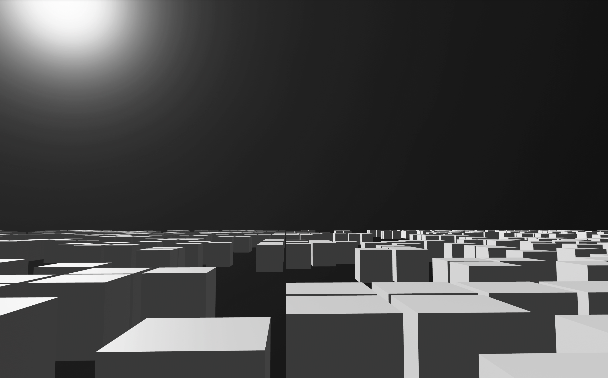
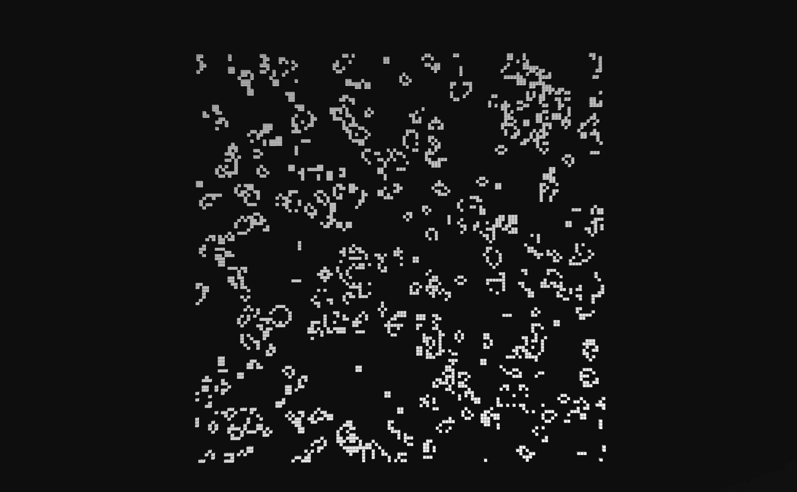

# Conway's Game of Life

Cory Zimmerman  
CS 175, Spring 2024

[Demo video](https://youtu.be/fP9J3-yNa3Y)

### Summary
I built Conway’s Game of Life with cubes in a harshly lit void. The Cellular Automata follow [these rules](https://en.wikipedia.org/wiki/Conway%27s_Game_of_Life) for birth, life, and death. Controls are listed on a screen overlay when the world is first entered. The simulation won’t start until you click. I highly recommend viewing in full screen, otherwise the mouse throws off movement immersion.

### Design
Rust is my strongest and favorite language, so I chose it for the final project. After this semester’s work in OpenGL, I wanted to try a higher level of abstraction, so I opted for the [Bevy](https://bevyengine.org) game engine. This was my first project using a game engine, so it took some time to familiarize myself. Having a more bare-metal background in graphics from this course, the engine was a nice quality of life boost and allowed me to move quickly once I understood its API.

### Project elements
- A subtle but significant part of the project was spent on camera motion. I love the camera controls in Minecraft and replicated the movement scheme from creative mode. Bevy uses quaternions for rotation, so the previous work on roll-free ego motion was directly applicable. The engine also has an easy abstraction for generating directed vectors from scene graph nodes, so directional translation again followed a familiar mental model. This code can be found in [src/scene/interaction.rs](https://github.com/cfzimmerman/conway/blob/main/src/scene/interaction.rs).
- State management was a recurring theme in this course. Bevy uses the Entity Component System (ECS) architecture for handling state. This was my first encounter with ECS, but it feels super powerful. The engine’s ECS architecture is still a bit mysterious to me, but it’s a wonderful abstraction that I’d love to use and explore more in the future.
- My simulation spawns a grid of cubes into the environment and changes visibility based on whether or not they should be alive. In the background, I’m running a logical simulation of Conway’s Game of Life, which can be found in [src/scene/sim.rs](https://github.com/cfzimmerman/conway/blob/main/src/scene/sim.rs). The simulation is ticked by an adjustable timer, and each tick causes cubes that died or were born to change visibility.
- The lighting was more of an artistic choice. I liked the idea of a “Game of Life” hovering in an empty void. The harsh lighting added a nice visual effect. Bevy has a pre-built entity for a positional light very similar to the ones we used in project 8. This is placed above the cube plane like the sun. Then, I wrapped my entire world in a giant sphere, turned off backface culling, and rendered the inside of the sphere with a high-gloss texture. The invisible positional light reflecting back off the inside of the sphere generates the hazy white sun effect. I liked this look more than the pure black void, which can still be visited by flying the camera beyond the radius of the world sphere. This code is mostly in [src/scene/world.rs](https://github.com/cfzimmerman/conway/blob/main/src/scene/world.rs).
- An initial version of the project used a cube mesh with rounded edges that I made in Blender. However, rendering 128 of these caused my frame rate to drop to single digits. I’m guessing it’s because the shape required  more processing to interact with lighting and shadow processing. Shifting from that to simple cubes was the greatest performance decision I made for the project.

### To run
There are two ways to access the project. 

1. The safest route is to build it yourself. To do so, follow these steps:
	- [Install Rust](https://www.rust-lang.org/tools/install) and restart / source your shell
	- Clone the repo and `cd conway`
	- Build and run the project: `cargo run --release` (warning, the first compilation will take 1 to 5 minutes)
2. Since the course requested binaries, I’ve also included those in [report](https://github.com/cfzimmerman/conway/tree/main/report). I’ve only tested the binaries on one M1 Mac and one x86-64 windows computer, so compatibility issues are definitely possible. If any arise, feel free to either email me or try to build from source.

